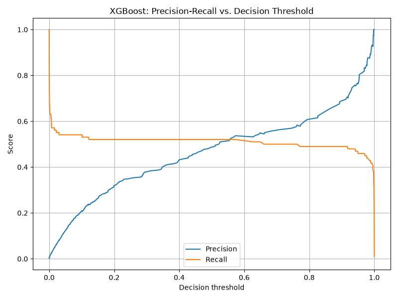
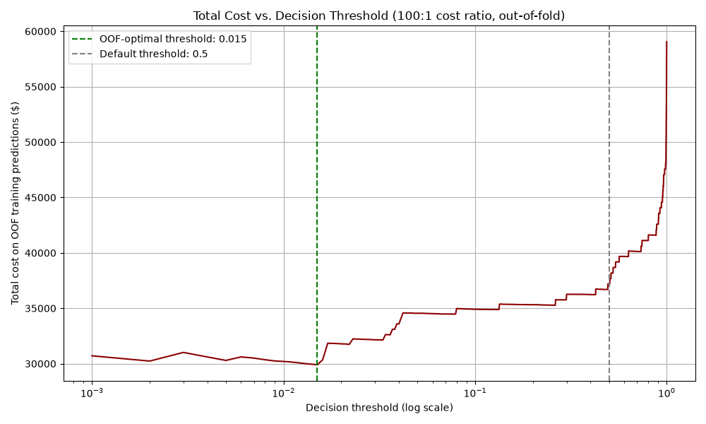
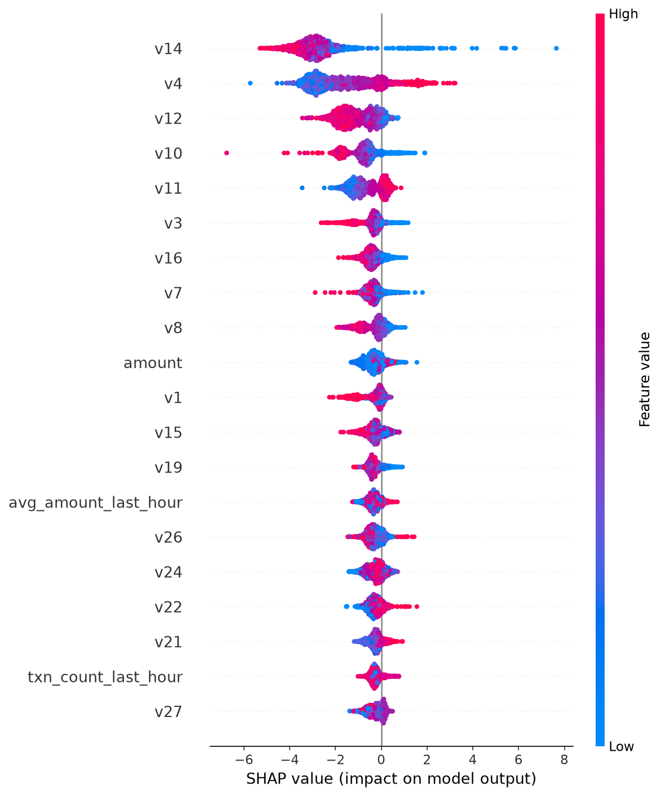
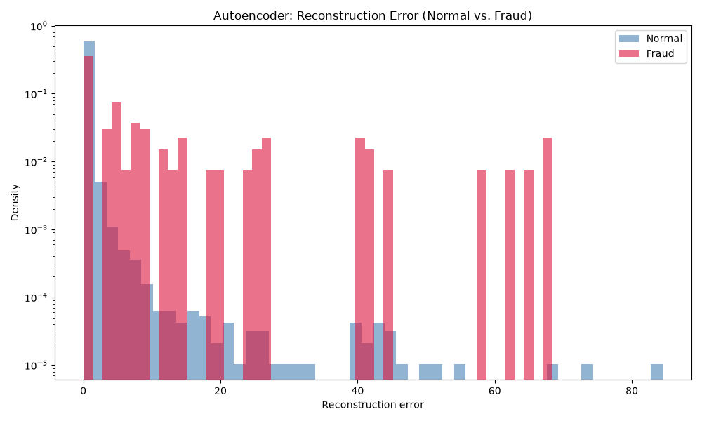
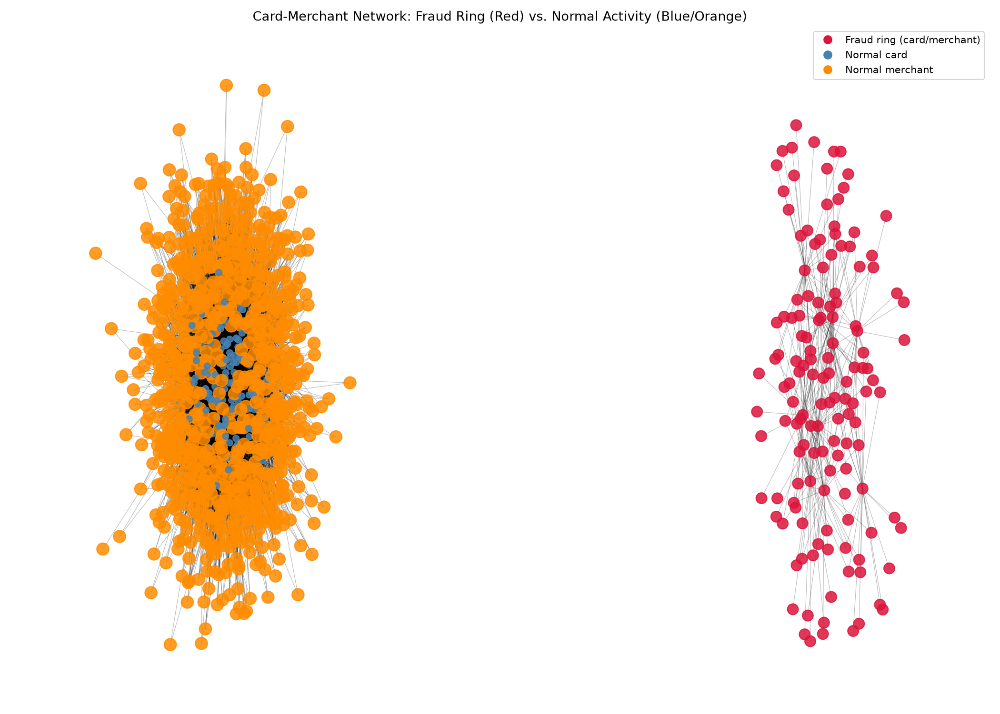
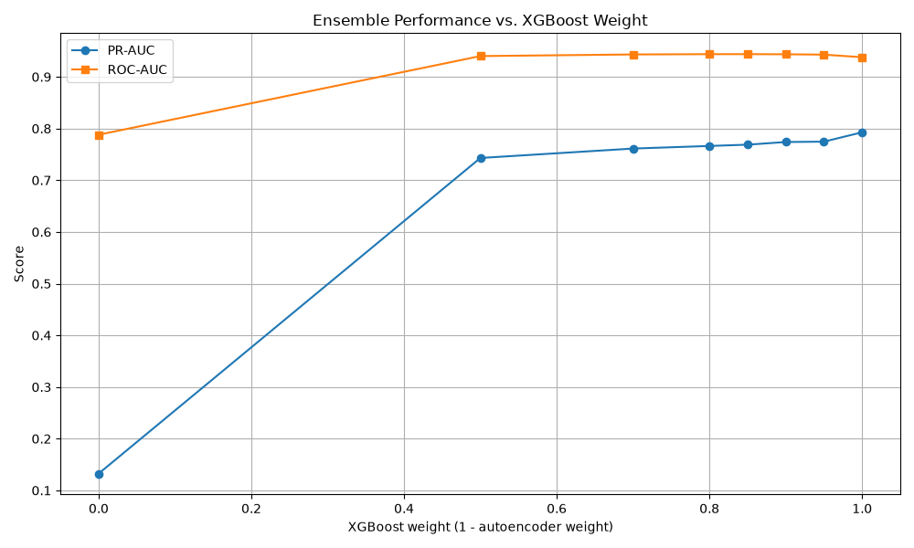
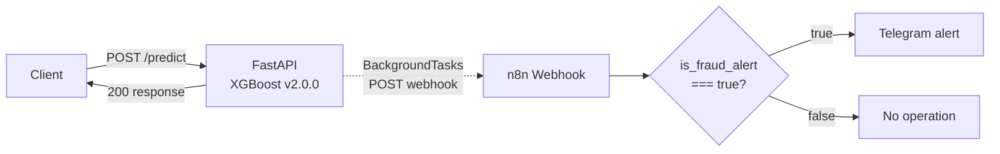

# Credit Card Fraud Detection

An end-to-end fraud detection system built on the [Kaggle Credit Card Fraud
Detection dataset](https://www.kaggle.com/mlg-ulb/creditcardfraud). The project
combines SQL-based feature engineering, classical ML with imbalance handling,
unsupervised anomaly detection, graph-based fraud ring detection, a served
REST API with drift monitoring, real-time Telegram fraud alerts via an n8n
workflow, and an interactive dashboard.

**This is a portfolio / learning project, not a production banking system.**
Several design decisions reflect that scope explicitly — see
[Limitations & Future Work](#limitations--future-work).

## Contents

- [Dataset](#dataset)
- [Project Structure](#project-structure)
- [Setup](#setup)
- [Pipeline (Run Order)](#pipeline-run-order)
- [Methodology & Results](#methodology--results)
- [Model Comparison Summary](#model-comparison-summary)
- [API & Dashboard](#api--dashboard)
- [Model Versioning](#model-versioning)
- [Limitations & Future Work](#limitations--future-work)

## Dataset

284,807 European credit card transactions, of which only 0.173% are fraudulent
— a severe class imbalance that shapes every design decision in this project
(metric choice, resampling strategy, threshold selection). Features `v1`–`v28`
are PCA components anonymized for privacy; only `amount` and `time` are raw.

## Project Structure

```
fraud-detection-project/
├── src/
│   ├── data_prep.py                    # shared data loading utilities
│   ├── load_data.py                    # loads raw CSV into PostgreSQL
│   ├── feature_engineering.py          # SQL window functions -> features.csv
│   ├── train_baseline.py               # LR vs. XGBoost vs. XGBoost+SMOTE
│   ├── cost_analysis.py                # cost-sensitive threshold optimization
│   ├── cross_validation.py             # 5-fold stratified CV
│   ├── shap_analysis.py                # SHAP interpretability
│   ├── autoencoder_fraud.py            # unsupervised anomaly detection
│   ├── simulate_graph_data.py          # simulates card/merchant IDs + fraud ring
│   ├── build_fraud_graph.py            # builds card-merchant graph, community detection
│   ├── verify_ring_detection.py        # confirms the ring lands in one community
│   ├── visualize_graph.py              # plots the ring vs. normal network
│   ├── train_with_graph_features.py    # baseline vs. graph-augmented XGBoost
│   ├── ensemble_model.py               # XGBoost + autoencoder ensemble
│   ├── realtime_simulation.py          # simulated live transaction stream
│   ├── create_model_registry.py        # writes models/model_registry.json
│   ├── api_service.py                  # FastAPI serving endpoint
│   ├── populate_logs.py                # sends sample traffic to the API
│   ├── drift_monitor.py                # Z-score drift check on prediction logs
│   └── dashboard.py                    # Streamlit demo
├── data/                                # generated CSVs and plots (gitignored)
├── models/                              # trained model artifacts (gitignored)
├── logs/                                # prediction logs (gitignored)
├── n8n/
│   └── fraud_alert_workflow.json       # importable n8n alert workflow
├── docs/
│   └── telegram_alert.png              # example Telegram fraud alert
├── requirements.txt
├── docker-compose.yml
└── .gitignore
```

## Setup

1. **Clone the repository and install dependencies:**
   ```bash
   pip install -r requirements.txt
   ```

2. **Start PostgreSQL:**
   ```bash
   docker-compose up -d
   ```
   By default this uses the password `changeme`; override it with a
   `POSTGRES_PASSWORD` environment variable if you want something else.

3. **Set up environment variables:**
   ```bash
   cp .env.example .env
   # edit .env with your own database credentials
   ```

4. **Download the dataset** from Kaggle and place `creditcard.csv` in `data/`.

## Pipeline (Run Order)

The scripts have dependencies on each other's output; run them in this order:

```
1.  load_data.py                    # raw CSV -> PostgreSQL
2.  feature_engineering.py          # SQL window functions -> data/features.csv
3.  train_baseline.py               # trains LR, XGBoost+SMOTE, XGBoost
4.  shap_analysis.py                # explains the model from step 3
5.  cost_analysis.py
6.  cross_validation.py
7.  autoencoder_fraud.py
8.  simulate_graph_data.py          # -> data/features_with_graph_ids.csv
9.  build_fraud_graph.py            # -> data/graph_features.csv
10. verify_ring_detection.py
11. visualize_graph.py
12. train_with_graph_features.py    # -> models/xgboost_baseline_model.pkl, xgboost_final_model.pkl
13. ensemble_model.py
14. realtime_simulation.py
15. create_model_registry.py        # -> models/model_registry.json (required before step 16)
16. api_service.py                  # uvicorn src.api_service:app --reload
17. populate_logs.py                # requires the API (step 16) running
18. drift_monitor.py
```

All scripts must live in the same directory (`src/`) since several import
from `data_prep.py` and `build_fraud_graph.py`.

## Methodology & Results

### 1. SQL-Based Feature Engineering

Raw data is loaded into PostgreSQL, then SQL window functions derive
time-based behavioral features:

- `txn_count_last_hour` — transactions in the preceding hour
- `avg_amount_last_hour` — average transaction amount in the preceding hour
- `time_since_last_txn` — seconds since the previous transaction

### 2. Classical ML Baseline

Logistic Regression and XGBoost were trained and compared, with class
imbalance handled via `class_weight='balanced'` and `scale_pos_weight`
respectively. **Accuracy is not used** as an evaluation metric — a model
that always predicts "not fraud" would score 99.8% accuracy while catching
zero fraud. ROC-AUC and PR-AUC (more reliable under imbalance) are used
instead.

| Model | ROC-AUC | PR-AUC | Precision | Recall |
|---|---|---|---|---|
| Logistic Regression | 0.837 | 0.266 | 0.01 | 0.64 |
| XGBoost | 0.830 | 0.501 | 0.49 | 0.52 |

XGBoost roughly doubles Logistic Regression's PR-AUC. Feature scaling was
tested and made no meaningful difference to Logistic Regression's score
(0.265 → 0.266), indicating the fraud patterns in this dataset are not
linearly separable — which is why the tree-based model performs better.

**Precision-recall threshold analysis:** recall stays roughly flat
(~50–55%) across thresholds from 0.05 to 0.55, meaning threshold tuning
alone cannot substantially raise recall — a fixed subset of fraud cases
is simply not distinguishable by this feature set. This motivated the
anomaly-detection experiment below.



### 3. Cost-Sensitive Threshold Optimization

The default 0.5 threshold ignores the fact that missing a fraud case and
raising a false alarm carry very different costs. Using illustrative
assumed costs (missed fraud: $500, false-alarm review: $5), total cost was
computed across all thresholds:

| Threshold | Total Cost |
|---|---|
| Optimal (0.10) | $23,510 |
| Default (0.50) | $23,765 |

The optimal threshold saves only ~$255 (~1%) over the default — a small
gain that reflects the same recall ceiling noted above: the constraint is
the model's discriminative capacity, not threshold placement. *(Cost
figures are illustrative; a real deployment would derive them from
finance/risk data.)*



### 4. Imbalanced Data: SMOTE vs. Class Weighting

| Approach | PR-AUC | Precision | Recall |
|---|---|---|---|
| Class Weighting | 0.501 | 0.49 | 0.52 |
| SMOTE | 0.482 | 0.27 | 0.51 |

SMOTE achieves similar recall but at a substantial precision cost, likely
because synthetic samples generated in a 32-dimensional space don't fully
capture the minority class's true distribution. Class weighting was used
going forward.

### 5. Cross-Validation

A single train/test split can be misleading, especially under imbalance.
5-fold stratified cross-validation (preserving the ~0.173% fraud ratio per
fold) gives:

| Metric | Mean | Std Dev |
|---|---|---|
| PR-AUC | 0.450 | ± 0.026 |
| ROC-AUC | 0.834 | ± 0.026 |

The low standard deviation indicates the single-split PR-AUC of 0.501 was
somewhat optimistic; the realistic expected range is ≈0.42–0.49.

### 6. Model Interpretability: SHAP

| Rank | Feature | Mean \|SHAP\| |
|---|---|---|
| 1 | amount | 1.029 |
| 2 | time_since_last_txn* | 0.929 |
| 3 | v12 | 0.701 |
| 4 | v4 | 0.488 |
| 5 | v14 | 0.419 |
| 6 | txn_count_last_hour* | 0.393 |
| 7 | v13 | 0.392 |
| 8 | v11 | 0.386 |
| 9 | v19 | 0.381 |
| 10 | avg_amount_last_hour* | 0.375 |

*SQL-derived features. All three SQL-engineered features rank in the top
10, with `time_since_last_txn` the second most influential feature overall
— concrete evidence that the SQL feature engineering step materially
improved the model. (The V-columns' SHAP directionality isn't
business-interpretable, since they're anonymized PCA components.)



### 7. Autoencoder-Based Anomaly Detection

An autoencoder trained only on normal transactions was tested as an
unsupervised alternative, using reconstruction error as an anomaly score.

| Metric | Value |
|---|---|
| ROC-AUC | 0.789 |
| PR-AUC | 0.140 |

This substantially underperforms XGBoost (PR-AUC 0.501). Strengthening the
architecture (batch norm, dropout, L1 regularization, early stopping,
learning-rate scheduling) did not meaningfully change the result —
confirming the gap is due to the approach, not model capacity. Fraud
patterns here are learnable, specific signals (per the SHAP analysis), not
random anomalies, which favors supervised learning. Autoencoders may still
add value for detecting genuinely novel, previously unseen fraud types not
covered by labeled training data.



### 8. Graph-Based Fraud Ring Detection

The original dataset has no card/merchant identifiers (removed for
privacy). To demonstrate relational fraud detection, IDs were simulated —
explicitly labeled as such — with 60% of fraud transactions deliberately
concentrated across a small set of 150 cards and 10 merchants, mimicking
how real fraud rings reuse a limited set of accounts.

A card-merchant bipartite graph was built with NetworkX, and Louvain
community detection applied. **Result:** all 139 ring nodes were placed
into a single, distinct community — no ring node was scattered elsewhere —
confirming the technique can isolate coordinated fraud patterns that
transaction-level models miss.

`visualize_graph.py` renders this visually (`data/fraud_ring_network.png`):
the ring appears as a fully disconnected cluster, isolated from a sampled
subgraph of normal card-merchant activity — a clear visual confirmation of
why the community-detection algorithm separates it so cleanly.



### 9. Effect of Graph Features on Model Performance

Adding `degree_centrality` and `community_size` to XGBoost:

| Metric | Baseline | With Graph Features | Delta |
|---|---|---|---|
| PR-AUC | 0.501 | 0.795 | +0.294 |
| ROC-AUC | 0.830 | 0.935 | +0.105 |

**Methodological caveat:** most of this gain reflects the simulation
design — the ring was deliberately small and isolated, making
`community_size` an almost direct fraud signal. Real fraud rings likely
overlap more with normal traffic, so real-world gains would probably be
more modest. Still, this demonstrates that relational information can add
real value beyond transaction-level features.

### 10. Ensemble: XGBoost + Autoencoder

The graph-augmented XGBoost and autoencoder scores were combined via a
weighted average (rescaled to [0, 1] first):

| Approach | ROC-AUC | PR-AUC |
|---|---|---|
| XGBoost only | 0.935 | 0.795 |
| Autoencoder only | 0.798 | 0.157 |
| Ensemble (85% XGBoost + 15% AE) | 0.939 | 0.794 |

The ensemble does not improve PR-AUC. A complementarity check — counting
fraud cases XGBoost ranked in its bottom half but the autoencoder ranked
in its top decile — found only **2 out of 98** missed-fraud cases where the
autoencoder offered a genuinely different signal. A full sweep of ensemble
weights (XGBoost weight from 0.0 to 1.0) confirmed PR-AUC increases
monotonically with XGBoost's weight, peaking at pure XGBoost. **Conclusion:**
for this dataset, the autoencoder adds no measurable value to the
supervised model — the two largely agree on the same fraud cases rather
than catching different ones.



### 11. Real-Time Simulation

The baseline model was wrapped in a simulated live transaction stream to
demonstrate end-to-end scoring behavior.

**Methodological issue found and fixed:** the first version sampled fraud
transactions from the *entire* dataset (train + test combined), which
leaked training examples into the simulation and produced an artificially
perfect result (447/492 correctly caught, 90.8% recall) — far above the
model's true 52% recall. After restricting the sample to the test split
only:

| Metric | Value |
|---|---|
| Total transactions | 148 |
| True positives | 53 / 98 |
| **Recall** | **54.1%** |
| False positives | 0 / 50 |
| Precision (this sample) | 100% |

54.1% recall is consistent with the model's true test-set recall (52%),
confirming the corrected simulation reflects genuine generalization
performance rather than memorization.

### 12. FastAPI Service & Drift Monitoring

The baseline model is served via FastAPI (`/predict`), logging every
request/response to `logs/prediction_log.jsonl` for drift analysis. Drift
is checked via Population Stability Index (PSI) as the primary metric,
since it doesn't assume a Gaussian distribution the way a Z-score does; a
Z-score is kept as a simple secondary check.

**Methodological issue found and fixed:** an initial drift check using
only 9 manually-entered log records was skewed by a single outlier
($20,000 test transaction), producing a false drift alarm (Z-score: 17.88).
After clearing manual test entries and populating the log with 900+
transactions sampled from real test data via an automated script:

| Metric | Value |
|---|---|
| Total records | 1,201 |
| Mean amount | $81.07 |
| Mean fraud probability | 0.0037 |
| Alert rate | 0.33% |
| PSI | 0.0221 (no significant shift, threshold 0.1) |
| Z-score (secondary) | -0.03 |
| Result | No drift detected |

This is a single-variable, Gaussian-assumption-free (PSI) check with a
simple Z-score as backup — see [Limitations](#limitations--future-work)
for further discussion.

*Transparency note:* `populate_logs.py` initially used a fixed random seed,
so repeated runs resent largely the same 253 unique transactions rather
than sampling new ones — of the 1,201 total log records, only 253 were
distinct. This didn't invalidate the drift conclusion (the underlying
distribution sampled was still representative), but it did mean the
"sample size" was smaller than the record count suggested. The script has
since been fixed to sample without a fixed seed on each run.

### 13. Real-Time Alerting with n8n

The served model (v2.0.0) is connected to a self-hosted [n8n](https://n8n.io) workflow that turns fraud predictions into instant Telegram notifications. This closes the loop between scoring a transaction and a human actually seeing the alert.



After each prediction, `/predict` sends `transaction_id`, `amount`, `fraud_probability` and `is_fraud_alert` to the URL in `N8N_WEBHOOK_URL`. The call runs in FastAPI `BackgroundTasks`, so the API response is not delayed (35–97 ms in local tests).


**Design decisions**

- **Single source of truth for the threshold.** The alert threshold lives only in the API (`ALERT_THRESHOLD = 0.10`, taken from the cost-sensitive analysis in section 3). n8n does not apply its own cutoff; it only routes on the API's `is_fraud_alert` decision. An earlier version used a separate 0.5 cutoff in n8n, which meant transactions the API flagged between 0.10 and 0.5 never reached Telegram.
- **Alerting never breaks scoring.** If n8n is unreachable, `/predict` still returns 200 and the failure is logged as a warning. If `N8N_WEBHOOK_URL` is unset, no webhook call is made at all.
- **Missing data fails loudly.** n8n's IF node uses a strict boolean check, so a payload without `is_fraud_alert` raises a type error instead of being silently treated as non-fraud.

**End-to-end test results** (real rows from the test split)

| Transaction | Probability | `is_fraud_alert` | Route |
| --- | --- | --- | --- |
| Fraud row | 1.00 | true | Telegram alert |
| Legitimate row, mid-range score | 0.30 | true | Telegram alert (missed under the old 0.5 cutoff) |
| Legitimate row | 0.00 | false | No operation |
| Any request, n8n stopped | — | — | API returned 200, warning logged |

Test predictions were removed from `logs/prediction_log.jsonl` afterwards so they would not affect drift monitoring (see the note on manual test entries in section 12).

**Setup**

1. Run n8n locally:
   ```
   docker run -d --name n8n --restart unless-stopped -p 5678:5678 -v n8n_data:/home/node/.n8n docker.n8n.io/n8nio/n8n
   ```
2. In n8n, import `n8n/fraud_alert_workflow.json`, select your Telegram credential (bot token from @BotFather) and enter your chat ID in the Telegram node, then publish the workflow.
3. Add the webhook URL to `.env`:
   ```
   N8N_WEBHOOK_URL=http://localhost:5678/webhook/fraud-alert
   ```
   If the API runs inside Docker, use `http://host.docker.internal:5678/webhook/fraud-alert` instead.
4. Start the API as usual. High-risk predictions now arrive in Telegram.

## Model Comparison Summary

| Approach | PR-AUC | ROC-AUC | Notes |
|---|---|---|---|
| Logistic Regression | 0.266 | 0.837 | Linear, weak baseline |
| XGBoost (base features) | 0.501 | 0.830 | Strong supervised baseline |
| XGBoost + SMOTE | 0.482 | 0.848 | Weaker than class weighting |
| Autoencoder (unsupervised) | 0.140 | 0.789 | Anomaly-based, underperforms |
| XGBoost + graph features | 0.795 | 0.935 | Best single model; not served live (see below) |
| Ensemble (XGBoost + AE) | 0.794 | 0.939 | Autoencoder adds no measurable value |

## API & Dashboard

**API:**
```bash
uvicorn src.api_service:app --reload
```
Interactive docs at `http://127.0.0.1:8000/docs`. Endpoints: `/predict`,
`/health`, `/models` (lists all registered model versions).

**Dashboard:**
```bash
streamlit run src/dashboard.py
```
Opens an interactive UI at `http://localhost:8501` for scoring individual
transactions against the same baseline model served by the API.

## Model Versioning

A lightweight model registry (`models/model_registry.json`) tracks every
trained model version, its metrics, and production status:

| Version | Model | PR-AUC | In Production? |
|---|---|---|---|
| 1.0.0 | Logistic Regression | 0.266 | No (exploratory) |
| **2.0.0** | **XGBoost Baseline** | **0.501** | **Yes (active)** |
| 3.0.0 | XGBoost + Graph Features | 0.795 | No |
| 3.1.0-experimental | Ensemble | 0.794 | No |

**Key architectural decision:** the highest-scoring model (3.0.0) is *not*
served in production. Its graph features require recomputing the full
card-merchant network, which isn't practical per-request in a real-time
API. The baseline (2.0.0), which only needs information available at
transaction time, is served instead; the graph-augmented model is kept for
offline/batch analysis (e.g. periodic fraud-ring scans).

## Limitations & Future Work

This project prioritizes demonstrating a range of techniques end-to-end
over production hardening. Known gaps, roughly in order of importance if
this were to move toward production:

- **Hyperparameter tuning:** models use largely default or manually-chosen
  hyperparameters (including the ensemble's 85/15 weighting, chosen via a
  coarse sweep rather than formal optimization). Systematic tuning
  (`GridSearchCV`, Optuna) was out of scope here but would be a natural
  next step.
- **Graph features from real relational data:** the fraud ring simulation
  uses synthetic card/merchant IDs, explicitly disclosed as such
  throughout this README. A production system would derive graph
  structure from real transaction relationships (shared devices, IPs,
  billing addresses) rather than simulated identifiers -- something the
  original dataset doesn't support, since it has no such fields to begin
  with.
- **API performance:** `/predict` currently builds a single-row pandas
  DataFrame per request and runs synchronously. At meaningful production
  traffic, this would be worth revisiting (NumPy-based scoring, async I/O
  for logging) — not necessary at this project's current scale, but a
  known scaling limitation.
- **Configuration management:** file paths are defined as module-level
  constants rather than centralized in a config file. Reasonable at this
  project's scale; a larger codebase would benefit from a shared config
  module.

**Addressed during development** (kept here for transparency): database
credentials were initially hardcoded with a real-looking default password;
this has been fixed via `.env` + `python-dotenv`, with no functional
default (see `.env.example`). Drift detection initially relied solely on
a Z-score, which assumes a roughly Gaussian distribution; Population
Stability Index (PSI) was added as the primary metric, with the Z-score
kept as a secondary check (see `drift_monitor.py`).