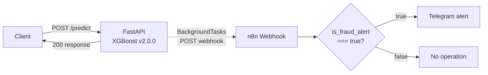

# Credit Card Fraud Detection

An end-to-end fraud detection system built on the [Kaggle Credit Card Fraud
Detection dataset](https://www.kaggle.com/mlg-ulb/creditcardfraud). The project
combines SQL-based feature engineering, classical ML with imbalance handling,
unsupervised anomaly detection, graph-based fraud ring detection, a served
REST API with drift monitoring, real-time Telegram fraud alerts via an n8n
workflow, and an interactive dashboard.

**This is a portfolio / learning project, not a production banking system.**
Several design decisions reflect that scope explicitly — see
[Limitations & Future Work](#limitations--future-work).

All results below were updated after a data-joining bug was found and
fixed; see [Data Alignment Fix](#data-alignment-fix) for what changed.

## Contents

- [Dataset](#dataset)
- [Project Structure](#project-structure)
- [Setup](#setup)
- [Pipeline (Run Order)](#pipeline-run-order)
- [Methodology & Results](#methodology--results)
- [Model Comparison Summary](#model-comparison-summary)
- [API & Dashboard](#api--dashboard)
- [Model Versioning](#model-versioning)
- [Data Alignment Fix](#data-alignment-fix)
- [Limitations & Future Work](#limitations--future-work)

## Dataset

284,807 European credit card transactions, of which only 0.173% are fraudulent
— a severe class imbalance that shapes every design decision in this project
(metric choice, resampling strategy, threshold selection). Features `v1`–`v28`
are PCA components anonymized for privacy; only `amount` and `time` are raw.

## Project Structure

```
fraud-detection-project/
├── src/
│   ├── data_prep.py                    # shared data loading utilities
│   ├── load_data.py                    # loads raw CSV into PostgreSQL
│   ├── feature_engineering.py          # SQL window functions -> features.csv
│   ├── train_baseline.py               # LR vs. XGBoost vs. XGBoost+SMOTE
│   ├── cost_analysis.py                # cost-sensitive threshold optimization
│   ├── cross_validation.py             # 5-fold stratified CV
│   ├── shap_analysis.py                # SHAP interpretability
│   ├── autoencoder_fraud.py            # unsupervised anomaly detection
│   ├── simulate_graph_data.py          # simulates card/merchant IDs + fraud ring
│   ├── build_fraud_graph.py            # builds card-merchant graph, community detection
│   ├── verify_ring_detection.py        # confirms the ring lands in one community
│   ├── visualize_graph.py              # plots the ring vs. normal network
│   ├── train_with_graph_features.py    # baseline vs. graph-augmented XGBoost
│   ├── ensemble_model.py               # XGBoost + autoencoder ensemble
│   ├── realtime_simulation.py          # simulated live transaction stream
│   ├── create_model_registry.py        # writes models/model_registry.json
│   ├── api_service.py                  # FastAPI serving endpoint
│   ├── populate_logs.py                # sends sample traffic to the API
│   ├── drift_monitor.py                # Z-score drift check on prediction logs
│   └── dashboard.py                    # Streamlit demo
├── data/                                # generated CSVs (gitignored) and plots (tracked)
├── models/                              # trained models (gitignored); model_registry.json (tracked)
├── logs/                                # prediction logs (gitignored)
├── n8n/
│   └── fraud_alert_workflow.json       # importable n8n alert workflow
├── tests/
│   └── test_data_alignment.py          # feature / PCA join alignment checks
├── requirements.txt
├── docker-compose.yml
└── .gitignore
```

## Setup

1. **Clone the repository and install dependencies:**
   ```bash
   pip install -r requirements.txt
   ```

2. **Start PostgreSQL:**
   ```bash
   docker-compose up -d
   ```
   By default this uses the password `changeme`; override it with a
   `POSTGRES_PASSWORD` environment variable if you want something else.

3. **Set up environment variables:**
   ```bash
   cp .env.example .env
   # edit .env with your own database credentials
   ```

4. **Download the dataset** from Kaggle and place `creditcard.csv` in `data/`.

## Pipeline (Run Order)

The scripts have dependencies on each other's output; run them in this order:

```
1.  load_data.py                    # raw CSV -> PostgreSQL
2.  feature_engineering.py          # SQL window functions -> data/features.csv
3.  train_baseline.py               # trains LR, XGBoost+SMOTE, XGBoost
4.  shap_analysis.py                # explains the model from step 3
5.  cost_analysis.py
6.  cross_validation.py
7.  autoencoder_fraud.py
8.  simulate_graph_data.py          # -> data/features_with_graph_ids.csv
9.  build_fraud_graph.py            # -> data/graph_features.csv
10. verify_ring_detection.py
11. visualize_graph.py
12. train_with_graph_features.py    # -> models/xgboost_baseline_model.pkl, xgboost_final_model.pkl
13. ensemble_model.py
14. realtime_simulation.py
15. create_model_registry.py        # -> models/model_registry.json (required before step 16)
16. api_service.py                  # uvicorn src.api_service:app --reload
17. populate_logs.py                # requires the API (step 16) running
18. drift_monitor.py
```

All scripts must live in the same directory (`src/`) since several import
from `data_prep.py` and `build_fraud_graph.py`. Run them from the project
root (e.g. `python src/train_baseline.py`), since file paths are relative
to it.

**Alignment tests:** after step 2 (and whenever the loaders change), run

```bash
python -m unittest discover -s tests
```

to confirm every row's SQL features and PCA components come from the same
raw transaction (see [Data Alignment Fix](#data-alignment-fix)).

## Methodology & Results

### 1. SQL-Based Feature Engineering

Raw data is loaded into PostgreSQL, then SQL window functions derive
time-based behavioral features:

- `txn_count_last_hour` — transactions in the preceding hour
- `avg_amount_last_hour` — average transaction amount in the preceding hour
- `time_since_last_txn` — seconds since the previous transaction

### 2. Classical ML Baseline

Logistic Regression and XGBoost were trained and compared, with class
imbalance handled via `class_weight='balanced'` and `scale_pos_weight`
respectively. **Accuracy is not used** as an evaluation metric — a model
that always predicts "not fraud" would score 99.8% accuracy while catching
zero fraud. ROC-AUC and PR-AUC (more reliable under imbalance) are used
instead.

| Model | ROC-AUC | PR-AUC | Precision | Recall |
|---|---|---|---|---|
| Logistic Regression | 0.972 | 0.720 | 0.06 | 0.90 |
| XGBoost | 0.975 | 0.876 | 0.90 | 0.83 |

*(Precision and recall at the default 0.5 threshold; test split, 98 fraud
cases.)* The two models have almost the same ROC-AUC, but ROC-AUC is
dominated by the ~57,000 legitimate transactions and hides the difference
that matters here: XGBoost's PR-AUC is 0.16 higher, and at the default
threshold Logistic Regression catches more fraud (recall 0.90) only by
raising roughly 16 false alarms per caught fraud (precision 0.06), versus
about one false alarm per nine caught frauds for XGBoost. A linear model on standardized features
already ranks most fraud highly, so the tree model's advantage is
precision rather than raw separability.

**Precision-recall threshold analysis:** XGBoost's recall moves only
slightly with the threshold — 0.83 at 0.5, 0.85 at 0.1, 0.88 at 0.01 —
while precision drops steeply (0.90 → 0.80 → 0.58). Lowering the threshold
buys a few additional fraud cases at a large false-alarm cost, and about
10% of test-set fraud stays below even very low thresholds.

The anomaly-detection experiment below was originally motivated by an
apparent recall ceiling of ~50–55% seen on misaligned data (see
[Data Alignment Fix](#data-alignment-fix)). That ceiling turned out to be
an artifact, but a smaller group of fraud cases the supervised model
cannot catch remains, so the question the experiment asks still applies.


### 3. Cost-Sensitive Threshold Optimization

The default 0.5 threshold ignores the fact that missing a fraud case and
raising a false alarm carry very different costs. Using illustrative
assumed costs (missed fraud: $500, false-alarm review: $5), the threshold
is chosen to minimize total cost **without looking at the test split**:

1. 5-fold stratified cross-validation on the training split (394 fraud
   cases) produces out-of-fold (OOF) probabilities from the same model
   configuration that is served.
2. Every threshold from 0.001 to 0.999 (step 0.001) is scored on those OOF
   predictions, and the cheapest one is selected: **0.015**.
3. The served model is evaluated at that threshold once on the held-out
   test split:

| Threshold | Total Cost | Recall | Precision | Alerts (of 56,962) |
|---|---|---|---|---|
| OOF-selected (0.015) | $6,750 | 0.867 | 0.630 | 135 |
| Default (0.50) | $8,545 | 0.827 | 0.900 | 90 |

The selected threshold saves ~$1,795 (~21%) over the default on the test
split: 4 more fraud cases caught for 41 extra false-alarm reviews. The API
uses it (`ALERT_THRESHOLD = 0.015`). *(Cost figures are illustrative; a
real deployment would derive them from finance/risk data.)*

**How stable is it?** Not very, at the assumed 100:1 ratio. Selected fold
by fold, the optimum is 0.001, 0.015, 0.001, 0.016 and 0.022; two of the
five folds land on the lower edge of the search grid. The OOF cost curve
is flat at the low end, staying within 5% of its minimum anywhere from
0.001 to 0.016, so in that range the choice barely changes the expected
cost while it changes the alert volume a lot. 0.015 is simply the minimum
the OOF analysis found; it was not picked by looking at alert counts. It
happens to sit at the upper end of the flat region, which also keeps the
number of alerts lower than thresholds further down would.

An earlier version of this analysis picked the threshold on the test split
itself (0.002, reported cost $5,480). Because the threshold and the
reported cost came from the same data, that figure was optimistic; at
0.002 the model also raises twice as many alerts (285) at half the
precision (0.31).

**Sensitivity to the assumed cost ratio** (false-alarm cost fixed at $5;
threshold selected on OOF predictions, then evaluated once on the test
split):

| FN:FP cost | Missed-fraud cost | OOF-selected threshold | Per-fold optima | Test recall | Test precision | Test alerts | Test cost | Test cost at 0.5 |
|---|---|---|---|---|---|---|---|---|
| 100:1 (used) | $500 | 0.015 | 0.001\*, 0.015, 0.001\*, 0.016, 0.022 | 0.867 | 0.630 | 135 | $6,750 | $8,545 |
| 50:1 | $250 | 0.015 | 0.005, 0.015, 0.002, 0.016, 0.022 | 0.867 | 0.630 | 135 | $3,500 | $4,295 |
| 20:1 | $100 | 0.015 | 0.034, 0.015, 0.016, 0.016, 0.022 | 0.867 | 0.630 | 135 | $1,550 | $1,745 |

\*lower edge of the search grid

All three ratios select the same threshold on the pooled OOF predictions.
The per-fold optima spread less as missed fraud gets cheaper: at 20:1 none
of them is on the grid edge.


### 4. Imbalanced Data: SMOTE vs. Class Weighting

| Approach | PR-AUC | Precision | Recall |
|---|---|---|---|
| Class Weighting | 0.876 | 0.90 | 0.83 |
| SMOTE | 0.870 | 0.81 | 0.86 |

The two approaches end up close: SMOTE trades some precision (0.81 vs.
0.90) for slightly higher recall at the default threshold, with a
marginally lower PR-AUC. Class weighting was used going forward, since it
performs about as well as SMOTE without adding ~227,000 synthetic
training rows.

### 5. Cross-Validation

A single train/test split can be misleading, especially under imbalance.
5-fold stratified cross-validation (preserving the ~0.173% fraud ratio per
fold) gives:

| Metric | Mean | Std Dev |
|---|---|---|
| PR-AUC | 0.855 | ± 0.027 |
| ROC-AUC | 0.976 | ± 0.008 |

The single-split PR-AUC of 0.876 sits at the upper end of the
cross-validated range, so it is slightly optimistic; the realistic
expected range is ≈0.83–0.88.

### 6. Model Interpretability: SHAP

| Rank | Feature | Mean \|SHAP\| |
|---|---|---|
| 1 | v14 | 2.889 |
| 2 | v4 | 1.823 |
| 3 | v12 | 1.047 |
| 4 | v10 | 0.914 |
| 5 | v11 | 0.720 |
| 6 | v3 | 0.464 |
| 7 | v16 | 0.432 |
| 8 | v7 | 0.410 |
| 9 | v8 | 0.390 |
| 10 | amount | 0.383 |

The model relies mainly on the PCA components. The SQL-derived features
contribute, but modestly: `avg_amount_last_hour` ranks 14th (0.346),
`txn_count_last_hour` 19th (0.298) and `time_since_last_txn` last of 32
(0.100). (The V-columns' SHAP directionality isn't business-interpretable,
since they're anonymized PCA components.)

An earlier version of this analysis, run on misaligned data (see
[Data Alignment Fix](#data-alignment-fix)), ranked all three SQL features
in the top 10 and `time_since_last_txn` second, and was presented as
evidence that the SQL step materially improved the model. That conclusion
does not hold on correctly joined data. One plausible explanation, not
verified: the misalignment only affected transactions sharing a timestamp
with another one, and `time_since_last_txn = 0` marks most of those rows,
so the feature may have helped the model discount unreliable PCA values
rather than capturing fraud behavior.


### 7. Autoencoder-Based Anomaly Detection

An autoencoder trained only on normal transactions was tested as an
unsupervised alternative, using reconstruction error as an anomaly score.

| Metric | Value |
|---|---|
| ROC-AUC | 0.952 |
| PR-AUC | 0.481 |

The autoencoder separates fraud from normal traffic reasonably well
(ROC-AUC 0.952) but its PR-AUC is far below XGBoost's 0.876, which
suggests its highest reconstruction errors include many unusual but
legitimate transactions alongside the fraud. Strengthening the architecture
(batch norm, dropout, L1 regularization, early stopping, learning-rate
scheduling) did not meaningfully change the result in the original
experiments; this was not re-tested after the data fix. Fraud patterns
here are learnable, specific signals (a handful of PCA components dominate
the SHAP ranking), which favors supervised learning. Autoencoders may still
add value for detecting genuinely novel, previously unseen fraud types not
covered by labeled training data.


### 8. Graph-Based Fraud Ring Detection

The original dataset has no card/merchant identifiers (removed for
privacy). To demonstrate relational fraud detection, IDs were simulated —
explicitly labeled as such — with 60% of fraud transactions deliberately
concentrated across a small set of 150 cards and 10 merchants, mimicking
how real fraud rings reuse a limited set of accounts.

A card-merchant bipartite graph was built with NetworkX, and Louvain
community detection applied. **Result:** all 139 ring nodes were placed
into a single, distinct community — no ring node was scattered elsewhere —
confirming the technique can isolate coordinated fraud patterns that
transaction-level models miss.

`visualize_graph.py` renders this visually (`data/fraud_ring_network.png`):
the ring appears as a fully disconnected cluster, isolated from a sampled
subgraph of normal card-merchant activity — a clear visual confirmation of
why the community-detection algorithm separates it so cleanly.


### 9. Effect of Graph Features on Model Performance

Adding `degree_centrality` and `community_size` to XGBoost:

| Metric | Baseline | With Graph Features | Delta |
|---|---|---|---|
| PR-AUC | 0.876 | 0.928 | +0.053 |
| ROC-AUC | 0.975 | 0.987 | +0.012 |

The gain is much smaller than the +0.294 reported before the data fix: a
stronger base model leaves less room for the graph features to add.

**Methodological caveat:** most of this gain reflects the simulation
design — the ring was deliberately small and isolated, making
`community_size` an almost direct fraud signal. Real fraud rings likely
overlap more with normal traffic, so real-world gains would probably be
more modest. The result shows that the pipeline can turn relational
structure into model features, not how much such features would help on
real data.

### 10. Ensemble: XGBoost + Autoencoder

The graph-augmented XGBoost and autoencoder scores were combined via a
weighted average (rescaled to [0, 1] first):

| Approach | ROC-AUC | PR-AUC |
|---|---|---|
| XGBoost only | 0.987 | 0.928 |
| Autoencoder only | 0.933 | 0.377 |
| Ensemble (85% XGBoost + 15% AE) | 0.980 | 0.919 |

*(The "Autoencoder only" row differs from section 7's 0.481 because
`ensemble_model.py` trains its own, simpler autoencoder on the same inputs
and split: 16-8-16 ReLU layers without batch norm, dropout or L1, for a
fixed 30 epochs without early stopping. Neither script seeds TensorFlow,
so autoencoder scores also vary slightly between runs.)*

The ensemble does not improve PR-AUC. A complementarity check — counting
fraud cases XGBoost ranked in its bottom half but the autoencoder ranked
in its top decile — found **0 out of 98** fraud cases where the
autoencoder offered a genuinely different signal. A full sweep of ensemble
weights (XGBoost weight from 0.0 to 1.0) confirmed PR-AUC increases
monotonically with XGBoost's weight, peaking at pure XGBoost. **Conclusion:**
for this dataset, the autoencoder adds no measurable value to the
supervised model — the two largely agree on the same fraud cases rather
than catching different ones.


### 11. Real-Time Simulation

The baseline model was wrapped in a simulated live transaction stream to
demonstrate end-to-end scoring behavior.

**Methodological issue found and fixed:** the first version sampled fraud
transactions from the *entire* dataset (train + test combined), which
leaked training examples into the simulation. At the time (before the
data alignment fix) it reported 90.8% recall against a true test-set
recall of 52%. The stream now draws only from the test split: every one
of its 98 fraud cases plus 50 random legitimate transactions, scored at
the API's alert threshold (0.015):

| Metric | Value |
|---|---|
| Total transactions | 148 |
| True positives | 85 / 98 |
| **Recall** | **86.7%** |
| False positives | 0 / 50 |
| Precision (this sample) | 100% |

Because the stream contains every test-set fraud case, its recall equals
the model's test-set recall at this threshold by construction. The 100%
precision is a small-sample effect: at 0.015 the model raises a false
alarm on about 0.09% of legitimate transactions (50 of 56,864; precision
0.63 on the full test split), so 50 legitimate transactions are expected
to produce well under one.

### 12. FastAPI Service & Drift Monitoring

The baseline model is served via FastAPI (`/predict`), logging every
request/response to `logs/prediction_log.jsonl` for drift analysis. Drift
is checked via Population Stability Index (PSI) as the primary metric,
since it doesn't assume a Gaussian distribution the way a Z-score does; a
Z-score is kept as a simple secondary check.

**Methodological issue found and fixed:** an initial drift check using
only 9 manually-entered log records was skewed by a single outlier
($20,000 test transaction), producing a false drift alarm (Z-score: 17.88).
After clearing manual test entries and populating the log with 1,200
transactions sampled from the held-out test split via `populate_logs.py`
(four runs of 300, API started with `N8N_ALERTS_ENABLED=false` so the
traffic doesn't trigger n8n alerts):

| Metric | Value |
|---|---|
| Total records | 1,200 (1,191 distinct transactions) |
| Mean amount | $92.99 (reference: $88.35) |
| Mean fraud probability | 0.00004 |
| Alert rate | 0.08% (1 alert; threshold 0.015) |
| PSI | 0.0109 (no significant shift, threshold 0.1) |
| Z-score (secondary) | 0.02 |
| Result | No drift detected |

This particular sample happens to contain no real fraud (about two were
expected at the dataset's 0.17% fraud rate), so the single alert is a
false alarm and the mean fraud probability is very low. The sample was
kept as drawn rather than re-drawn to look more typical; for reference,
the whole test split produces 135 alerts on 56,962 transactions (0.24%)
at this threshold.

This is a single-variable, Gaussian-assumption-free (PSI) check with a
simple Z-score as backup — see [Limitations](#limitations--future-work)
for further discussion.

*Transparency note:* earlier versions of `populate_logs.py` used a fixed
random seed (so the previous 1,201-record log held only 253 distinct
transactions) and sampled from the full dataset, about 80% of which is
training data. Both are fixed: the script now samples the test split
without a fixed seed, and the log was regenerated with the retrained
model after the [data alignment fix](#data-alignment-fix).

### 13. Real-Time Alerting with n8n

The served model (v2.0.0) is connected to a self-hosted [n8n](https://n8n.io) workflow that turns fraud predictions into instant Telegram notifications. This closes the loop between scoring a transaction and a human actually seeing the alert.



After each prediction, `/predict` sends `transaction_id`, `amount`, `fraud_probability` and `is_fraud_alert` to the URL in `N8N_WEBHOOK_URL`. The call runs in FastAPI `BackgroundTasks`, so the API response is not delayed (35–98 ms across local test runs). Setting `N8N_ALERTS_ENABLED=false` turns the webhook off without touching the URL (used when generating test traffic).

**Design decisions**

- **Single source of truth for the threshold.** The alert threshold lives only in the API (`ALERT_THRESHOLD = 0.015`, taken from the cost-sensitive analysis in section 3). n8n does not apply its own cutoff; it only routes on the API's `is_fraud_alert` decision. An earlier version used a separate 0.5 cutoff in n8n, which meant transactions the API flagged below 0.5 never reached Telegram.
- **Alerting never breaks scoring.** If n8n is unreachable, `/predict` still returns 200 and the failure is logged as a warning. If `N8N_WEBHOOK_URL` is unset or `N8N_ALERTS_ENABLED=false`, no webhook call is made at all.
- **Missing data fails loudly.** n8n's IF node uses a strict boolean check, so a payload without `is_fraud_alert` raises a type error instead of being silently treated as non-fraud.

**End-to-end test results** (real rows from the test split, unseen during training; split from `data_prep.get_train_test_indices`, the same one the served model was trained on)

| Transaction | Probability | `is_fraud_alert` | Route |
| --- | --- | --- | --- |
| Fraud row | 0.9999 | true | Telegram alert |
| Legitimate row, above the alert threshold | 0.2082 | true | Telegram alert (missed under the old 0.5 cutoff) |
| Legitimate row | 0.0000 | false | No operation |
| Fraud row above, n8n stopped | 0.9999 | true | API returned 200, warning logged |

Test predictions were removed from `logs/prediction_log.jsonl` afterwards so they would not affect drift monitoring (see the note on manual test entries in section 12).

**Setup**

1. Run n8n locally:
   ```
   docker run -d --name n8n --restart unless-stopped -p 5678:5678 -v n8n_data:/home/node/.n8n docker.n8n.io/n8nio/n8n
   ```
2. In n8n, import `n8n/fraud_alert_workflow.json`, select your Telegram credential (bot token from @BotFather) and enter your chat ID in the Telegram node, then publish the workflow.
3. Add the webhook URL to `.env`:
   ```
   N8N_WEBHOOK_URL=http://localhost:5678/webhook/fraud-alert
   ```
   If the API runs inside Docker, use `http://host.docker.internal:5678/webhook/fraud-alert` instead.
4. Start the API as usual. High-risk predictions now arrive in Telegram.

## Model Comparison Summary

| Approach | PR-AUC | ROC-AUC | Notes |
|---|---|---|---|
| Logistic Regression | 0.720 | 0.972 | Linear baseline; high recall but very low precision at 0.5 |
| XGBoost (base features) | 0.876 | 0.975 | Served model (2.0.0) |
| XGBoost + SMOTE | 0.870 | 0.977 | No gain over class weighting |
| Autoencoder (unsupervised) | 0.481 | 0.952 | Anomaly-based, well below supervised |
| XGBoost + graph features | 0.928 | 0.987 | Best single model; not served live (see below) |
| Ensemble (XGBoost + AE) | 0.919 | 0.980 | Autoencoder adds no measurable value |

## API & Dashboard

**API:**
```bash
uvicorn src.api_service:app --reload
```
Interactive docs at `http://127.0.0.1:8000/docs`. Endpoints: `/predict`,
`/health`, `/models` (lists all registered model versions).

**Dashboard:**
```bash
streamlit run src/dashboard.py
```
Opens an interactive UI at `http://localhost:8501` for scoring individual
transactions against the same baseline model served by the API.

## Model Versioning

A lightweight model registry (`models/model_registry.json`) tracks every
trained model version, its metrics, and production status:

| Version | Model | PR-AUC | In Production? |
|---|---|---|---|
| 1.0.0 | Logistic Regression | 0.720 | No (exploratory) |
| **2.0.0** | **XGBoost Baseline** | **0.876** | **Yes (active)** |
| 3.0.0 | XGBoost + Graph Features | 0.928 | No |
| 3.1.0-experimental | Ensemble | 0.919 | No |

All versions were retrained on 2026-09-23 after the
[data alignment fix](#data-alignment-fix); version numbers were kept.

**Key architectural decision:** the highest-scoring model (3.0.0) is *not*
served in production. Its graph features require recomputing the full
card-merchant network, which isn't practical per-request in a real-time
API. The baseline (2.0.0), which only needs information available at
transaction time, is served instead; the graph-augmented model is kept for
offline/batch analysis (e.g. periodic fraud-ring scans).

## Data Alignment Fix

**How it was found.** While preparing real test-split transactions for the
n8n end-to-end test (section 13), rebuilding the training split showed
that the loaders attach the PCA components by timestamp rather than by
transaction. A follow-up check found that in only ~45% of rows did the
transaction amount match the raw row the PCA components came from.

**The problem.** The SQL feature step (`features.csv`) keeps
`transaction_id`, the 1-based row number assigned in `load_data.py`. The
Python loaders, however, re-attached the PCA components `v1`–`v28` from
`creditcard.csv` by joining on `time_seconds` and then dropping
duplicates. Timestamps are not unique (239,644 raw rows share theirs with
another transaction), so each such row received the PCA components of
whichever transaction with the same timestamp came first. Only 43.85% of
rows had their own PCA components, and 462 rows had components from a
transaction with a different label. Every model and analysis in this
README was affected; the SQL features themselves were correct.

**The fix.** `data_prep.py` now joins on `transaction_id` (one-to-one,
validated) and checks every row's amount, timestamp and label against the
raw transaction, failing loudly on any mismatch.
`tests/test_data_alignment.py` asserts 100% alignment on the real data.
The simulated card/merchant IDs, and therefore the graph features, are
byte-identical before and after the fix.

**Impact** (test split unless noted):

| Metric | Before | After |
|---|---|---|
| Rows with their own PCA components | 43.85% | 100% |
| Rows with PCA components from a different-label transaction | 462 | 0 |
| XGBoost (served) PR-AUC / ROC-AUC | 0.501 / 0.830 | 0.876 / 0.975 |
| Logistic Regression PR-AUC | 0.266 | 0.720 |
| 5-fold CV PR-AUC | 0.450 ± 0.026 | 0.855 ± 0.027 |
| XGBoost + graph features PR-AUC | 0.795 | 0.928 |
| Gain from graph features (PR-AUC) | +0.294 | +0.053 |
| Autoencoder PR-AUC | 0.140 | 0.481 |
| Cost-optimal threshold / saving vs. 0.5 | 0.10 / ~1% (selected on test split) | 0.015 / ~21% (selected on OOF training predictions) |
| Best-ranked SQL feature (SHAP) | 2nd | 14th |

**Conclusions that changed:**

- *"XGBoost roughly doubles Logistic Regression's PR-AUC"* (section 2):
  now 0.876 vs. 0.720; the gap is mainly in precision.
- *"Recall is stuck at ~50–55% across thresholds; a fixed subset of fraud
  is not distinguishable"* (section 2): recall is now 83–88% for
  thresholds from 0.5 down to 0.01; about 10% of test-set fraud remains hard to catch.
- *"Threshold tuning barely matters"* (section 3): the cost-optimal
  threshold now saves ~21% over the default.
- *"The SQL features are among the most influential"* (section 6): they
  now rank 14th, 19th and 32nd of 32.
- The size of the graph-feature gain (section 9): +0.053 instead of +0.294.

The ensemble and autoencoder conclusions still hold.

## Limitations & Future Work

This project prioritizes demonstrating a range of techniques end-to-end
over production hardening. Known gaps, roughly in order of importance if
this were to move toward production:

- **Hyperparameter tuning:** models use largely default or manually-chosen
  hyperparameters (including the ensemble's 85/15 weighting, chosen via a
  coarse sweep rather than formal optimization). Systematic tuning
  (`GridSearchCV`, Optuna) was out of scope here but would be a natural
  next step.
- **Graph features from real relational data:** the fraud ring simulation
  uses synthetic card/merchant IDs, explicitly disclosed as such
  throughout this README. A production system would derive graph
  structure from real transaction relationships (shared devices, IPs,
  billing addresses) rather than simulated identifiers -- something the
  original dataset doesn't support, since it has no such fields to begin
  with.
- **Threshold stability:** the alert threshold (0.015) is selected on
  out-of-fold training predictions, but at the assumed 100:1 cost ratio
  the per-fold optima range from 0.001 to 0.022 and the cost curve is flat
  at the low end (see section 3). The operating point therefore rests on
  a few hundred fraud cases and on an illustrative cost ratio; with real
  cost data it should be re-derived and monitored as fraud patterns shift.
- **API performance:** `/predict` currently builds a single-row pandas
  DataFrame per request and runs synchronously. At meaningful production
  traffic, this would be worth revisiting (NumPy-based scoring, async I/O
  for logging) — not necessary at this project's current scale, but a
  known scaling limitation.
- **Configuration management:** file paths are defined as module-level
  constants rather than centralized in a config file. Reasonable at this
  project's scale; a larger codebase would benefit from a shared config
  module.

**Addressed during development** (kept here for transparency): database
credentials were initially hardcoded with a real-looking default password;
this has been fixed via `.env` + `python-dotenv`, with no functional
default (see `.env.example`). Drift detection initially relied solely on
a Z-score, which assumes a roughly Gaussian distribution; Population
Stability Index (PSI) was added as the primary metric, with the Z-score
kept as a secondary check (see `drift_monitor.py`).